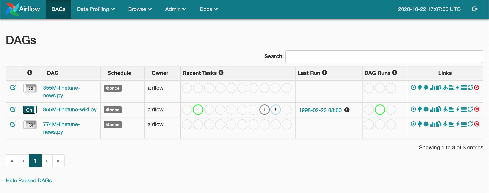

# GPT-2 Pipeline



This repository contains code for creating a end-end TFX pipeline for GPT-2. The pipeline contains the needed data preprocessing, exporting data from MongoDB, training with pretrained model and deployment to a MLFlow model registry. In the registry there is a possibility set a label for each produced models, which can be used later on to define the production-readiness state of a model. All pipelines can be orchestrated with either Airflow, Beam or Kubeflow. Tensorboard is supported and can be used for keeping a track during training. 

**Which pipelines are available?**
- Finetune from OpenAI models alias Transfer Learning
- Train from scatch. It is not recommended to do Transfer Learning, when you want to train on datasets with different languages.

**Why TFX?**

- TFX is a open source framework for creating production grade end-end machine learning pipelines.
- It handles a lot of useful things like caching and versioning
- Support for Airflow and Kubeflow

**Why Tensorboard?**

- Tensorflow native visualization tool
- Powerful tool

**Why MLFlow**

- Built-in Model Registy
- Dashboard for comparing models, their performance and produces artifacts
- [mlflow-heroku](https://github.com/NewsPipe/mlflow-heroku): Repository for setting up MLFlow on heroku

## Getting Started

### Install package
```bash
git clone https://github.com/steven-mi/tfx-gpt2.git
cd tfx-gpt2
pip indstall tfx-gpt2
```

### Run pipeline with Apache Beam

```bash
cd examples
python beam-local-example.py
# open mlflow and tensorboard
mlflow server --backend-store-uri sqlite:///mlflow.d --default-artifact-root ./mlruns
tensorboard --logdir ./outputs
```

### Run with Apache Airflow

```bash
# ... setup airflow
# copy files to dag folder
cp airflow-local-example.py $AIRFLOW_HOME/dags
cp -r data $AIRFLOW_HOME/dags
# start scheduler and executor
airflow scheduler -D
airflow webserver 
# go to localhost:8080 an start the DAG
# outputs are stored in $AIRFLOW_HOME/dags and can be changed in airflow-local-example.py
cd $AIRFLOW_HOME/dags
mlflow server --backend-store-uri sqlite:///mlflow.d --default-artifact-root ./mlruns
tensorboard --logdir ./outputs
```


## List of available models

Look at the [Paper](https://openai.com/blog/better-language-models/) for performance details. Choose the model depending on your resources. Insert the model name as string value for `model_name` in your pipeline.

| Model Name        | Layers | Comments                                                     |
| ----------------- | ------ | ------------------------------------------------------------ |
| `117M`<br/>`124M` | 12     | Could be trained on a CPU or a single for a reasonable amount of time |
| `345M`<br/>`355M` | 24     | Could be trained on a single GPU for a reasonable amount of time |
| `774M`            | 36     | Learned to love it. Largest model I could run on my work machine. If you have enough ressources - go for it. |
| `1558M`           | 48     | Largest model trained. Probably won't run on a single consumer GPU. Known for super human performance (see: https://openai.com/blog/better-language-models/) |


## Training recommendations
- GPT-2 models' robustness and worst case behaviors are not well-understood. As with any machine-learned model, carefully evaluate GPT-2 for your use case, especially if used without fine-tuning or in safety-critical applications where reliability is important.

From [gpt-2-simple](https://github.com/minimaxir/gpt-2-simple): The method GPT-2 uses to generate text is slightly different than those like other packages like textgenrnn (specifically, generating the full text sequence purely in the GPU and decoding it later), which cannot easily be fixed without hacking the underlying model code. As a result:
- In general, GPT-2 is better at maintaining context over its entire generation length, making it good for generating conversational text. The text is also generally gramatically correct, with proper capitalization and few typoes.
- The original GPT-2 model was trained on a very large variety of sources, allowing the model to incorporate idioms not seen in the input text.
- GPT-2 cannot stop early upon reaching a specific end token. (workaround: pass the truncate parameter to a generate function to only collect text until a specified end token. You may want to reduce length appropriately.)
- Higher temperatures work better (e.g. 0.7 - 1.0) to generate more interesting text, while other frameworks work better between 0.2 - 0.5.
- GPT-2 allows you to generate texts in parallel by setting a batch_size that is divisible into nsamples, resulting in much faster generation. Works very well with a GPU (can set batch_size up to 20 on Colaboratory's K80)!
- Due to GPT-2's architecture, it scales up nicely with more powerful GPUs. For the 124M model, if you want to train for longer periods of time, GCP's P100 GPU is about 3x faster than a K80/T4 for only 3x the price, making it price-comparable (the V100 is about 1.5x faster than the P100 but about 2x the price). The P100 uses 100% of the GPU even with batch_size=1, and about 88% of the V100 GPU.
